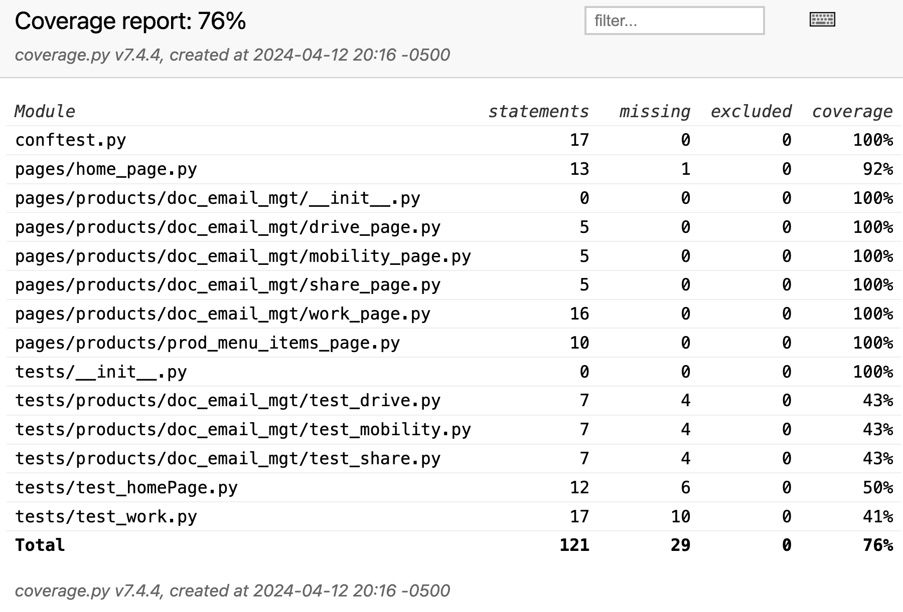

# IManage UI Test Automation
# Project under development
Python, Playwright, CI/CD Jenkins, Pytest, 

# Structure
```
.
├── Jenkinsfile
├── README.md
├── app_contents.json
├── conftest.py
├── page_url.json
├── pages
│   ├── home_page.py
│   └── products
│       ├── doc_email_mgt
│       │   ├── __init__.py
│       │   ├── drive_page.py
│       │   ├── mobility_page.py
│       │   ├── share_page.py
│       │   └── work_page.py
│       ├── prod_menu_items_page.py
│       └── security_governance
├── pytest.ini
├── requirements.txt
├── results
│   └── test_report.html
└── tests
    ├── __init__.py
    ├── products
    │   ├── doc_email_mgt
    │   │   ├── test_drive.py
    │   │   ├── test_mobility.py
    │   │   └── test_share.py
    │   └── security_governance
    ├── test_homePage.py
    └── test_work.py
```

# Reporting
HTML

# Test Coverage
```python3 -m pip install coverage```

### Run

```coverage run -m pytest```

More information([https://coverage.readthedocs.io/en/7.4.4/])

HTML View - ```coverage html```




# CI/CD 
Jenkins

# Fixtures

# JSON objects
app_contents
page_url.json

# Requirements
.
.


# PageObjects
.
.

# Config
.
.

# How to run test
.
.

# Handy Commands
.
.

